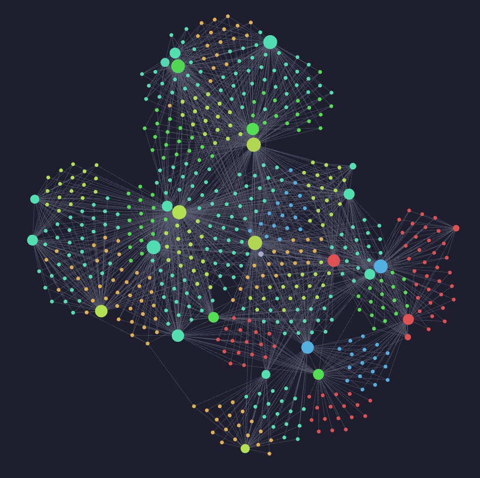

# 🧠 BrainVault for Claude Code

> Persistent, structured memory for Claude Code - backed by your Obsidian vault.

[](CHANGELOG.md)
[](LICENSE)
[](https://claude.ai/code)

Claude Code forgets everything between sessions. You explain the same project context, re-share the same bug solutions, correct the same mistakes - every single time you open a new conversation.

**BrainVault changes this.** After each session, Claude writes structured memory files into an Obsidian vault. At the start of the next session, it reads them back. Over time, your AI assistant builds genuine, observable knowledge of your project.

---


*Your AI's knowledge - visible as an Obsidian graph. Projects, solutions, and insights all connected.*

---

## What changes

| Without BrainVault | With BrainVault |
|---|---|
| Re-explain the tech stack every session | Auto-loaded from `project/` memory |
| Claude repeats past mistakes | `feedback/` memories prevent recurrence |
| Bug solutions disappear after the chat | Archived in `solutions/` forever |
| No visibility into what Claude "knows" | Full graph visible in Obsidian |
| Cold start on every conversation | Context already loaded from day one |

---

## How It Works

```
You work with Claude
       │
       ▼  session ends
Claude writes structured memory files → Obsidian vault
       │
       ▼  next session starts
MEMORY.md auto-loaded by Claude Code
       │
       ▼
Claude picks up where it left off
```

**Six memory types, each with a purpose:**

| Type | File pattern | What gets stored |
|---|---|---|
| `user` | `user/{slug}.md` | Your background, expertise, working style |
| `project` | `project/proj-{name}.md` | Tech stack, conventions, current focus per project |
| `solution` | `solutions/sol-{project}-{topic}.md` | Root cause + fix for every non-trivial bug |
| `agent` | `agents/agent-{topic}.md` | Which agent/subagent (and prompt) fit which kind of task, for reuse |
| `feedback` | `feedback/feedback-{topic}.md` | Corrections and confirmations of Claude's behaviour |
| `reference` | `reference/{slug}.md` | External links, dashboards, system pointers |

`history/YYYY-MM-DD.md` files log what *changed in the memory system* after each session - a changelog of what was learned, not a transcript.

---

## Quick Start

```bash
# 1. Install (in your terminal)
claude plugin marketplace add Francesco070/brainvault-cc
claude plugin install brainvault-cc
```

```
# 2. Set up your vault (inside Claude Code)
/brainvault-setup
```

The setup command auto-detects your Obsidian vault, creates the memory structure, configures `~/CLAUDE.md`, and grants Claude Code write access to the vault - one command, no manual file editing required.

---

## Installation

### Prerequisites

- [Claude Code](https://claude.ai/code) installed
- Obsidian (or any directory you want to use as the memory store)
- `bash` (macOS / Linux / WSL)

### 1. Add the plugin

**Via marketplace (recommended):**
```bash
claude plugin marketplace add Francesco070/brainvault-cc
claude plugin install brainvault-cc
```

**From a cloned repo:**
```bash
git clone https://github.com/Francesco070/brainvault-cc
claude plugin install ./brainvault-cc
```

### 2. Initialise your vault

Run inside Claude Code:

```
/brainvault-setup
```

Or pass the vault path directly to skip auto-detection:

```
/brainvault-setup /path/to/your/Obsidian/Claude/Memories
```

**Vault structure created:**

```
Memories/
├── MEMORY.md          ← auto-loaded by Claude Code at session start
├── HISTORY.md         ← index of daily memory changelogs
├── user/              ← who you are, your expertise and preferences
├── project/           ← per-project stack, conventions, focus
├── solutions/         ← archived bug fixes with root cause + fix
├── agents/            ← which agent/subagent (and prompt) fit which task, for reuse
├── feedback/          ← corrections and confirmations for Claude's behaviour
├── reference/         ← external links, dashboards, system pointers
└── history/           ← daily changelog of what Claude learned
```

<details>
<summary>Manual alternative (without the skill)</summary>

```bash
~/.claude/plugins/cache/Francesco070/brainvault-cc/0.2.0/scripts/init-or-update-vault.sh \
  --vault /path/to/your/Obsidian/Claude/Memories
```

Then copy `CLAUDE.md.template` and replace all `{{VAULT_PATH}}` occurrences manually.

</details>

---

## Updating

When a new plugin version is released:

```bash
claude plugin update brainvault-cc
```

Then apply any pending migrations:

```
/brainvault-setup
```

Migrations are **additive only** - they never delete or overwrite your existing memory files.

---

## Health check

```
/brainvault-doctor
```

Checks vault structure, frontmatter, duplicate slugs, oversized files, and broken
`MEMORY.md` links. Report-only by default; add `--fix` to let it repair structural issues
(missing folders, missing index skeletons) — always backed up first, never destructive.
Claude also runs this on its own whenever something in the vault looks corrupted, not just
when asked.

---

## Philosophy

**Solution files, not bloated project files.** Non-trivial bug fixes get their own file (`sol-{project}-{topic}.md`) with problem, root cause, fix, and key insights. Project memory stays lean - stack and conventions, not a log of every past fix.

**Wikilinks for backlinks.** `[[wikilinks]]` between memory files create Obsidian backlinks automatically. You can see which solutions relate to which project without maintaining a manual index.

**History as a memory changelog.** `history/YYYY-MM-DD.md` tracks what *changed in the memory system* - new files, corrections, additions - not the conversation itself.

---

## License

[MIT](LICENSE)
